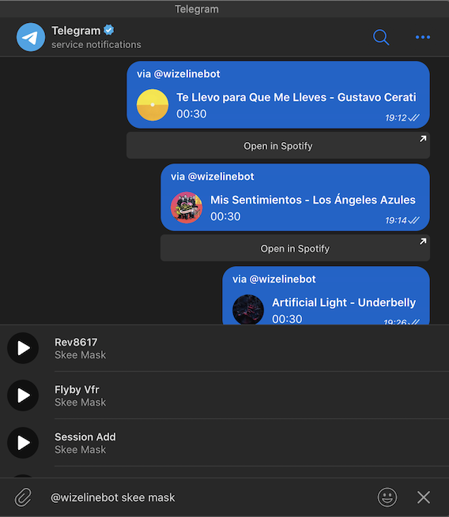

# Telegram Spotify Music Preview Bot

Proof of concept of a telegram bot that can search for songs using Spotify's API and return results that can be previewed inside Telegram.

You can check it out, just open telegram and start typing `@wizelinebot something` inside any chat, it works as an inline bot similar to @gif or @pic.

_(If you don't get a response soon try sending a direct message to `@wizelinebot`, this may be due to the bot not being publicly listed since it's just a POC, after that try using the inline mode again in the chat of your choosing)_



## Running your own bot instance

#### Requirements

-   Go runtime installed and configured
-   Spotify developer account (https://developer.spotify.com)
-   Telegram bot created with inline mode enabled (https://core.telegram.org/bots/api)

Additionally, you can use [`ngrok`](https://ngrok.com) for local development since Telegram only accepts endpoints that serve via https.

#### Environment variables

If you don't want to declare system wide environment variables, you can create a `.env` file in the root of your project, use the provided `.env.example` file as a guide to what variables need to be declared.

-   `APP_URL`: The base URL where your app will be running. Be sure to serve https otherwise telegram won't send any update to your app. If you are using `ngrok` for local development, please use the https url that ngrok provides.

-   `TELEGRAM_TOKEN`: You'll get this token after you have followed Telegram's guide to creating a bot. This token not only is the way to authenticate your application with Telegram, it also will be used to define the endpoint to receive updates according to Telegram's best practices.

-   `SPOTIFY_AUTH`: Once you created your developer account and created an app in Spotify, you'll have access to a client id and client secret. To generate the value stored in this variable just append your client id and your client secret separated by a colon, e.g. `YOUR_ID:YOUR_SECRET`, afterwards convert that string to a base64 value. This is the standard way to do http basic authorization, the alternative way would have been to provide both client id and secret and let the app do the rest of the calculation, but since it's a static value I decided to just precompute it and provide it here.

#### Setting the webhook for Telegram

All telegram updates will be sent to the endpoint of your choosing. This app provides an easy way to set it up by using a script. After you have configured your environment variables just run the following command in the app's base directory:

```
go run scripts/set_telegram_webhook.go
```

If you prefer you can set the webhook endpoint manually by sending a `POST` request to the Telegram API, just follow the instructions at https://core.telegram.org/bots/api#setwebhook

#### Building and running your app

After setting your environment variables and the telegram webhook you're good to go, just run this command in your app's base directory:

```
go build && go run main.go
```

Once running, try searching for a song using your bot's handle inside telegram, e.g. `@yourbotname something`. Choose a result from the list and you'll provide a message with the song preview and link to spotify in any chat you want.

#### Other notes

Be aware that your bot will only display results for those tracks that have a preview url. Spotify does not provide previews for all available tracks, maybe for legal reasons, so don't be surprised if you don't get any result when searching for the Beatles.

## Future improvements

-   Ability to respond to direct messages, at least to provide an instruction to users so that they know they should use inline mode only.
-   More music streaming services options to provide a wider array of available tracks.
-   Add preview image and more information to inline results.
-   Include tracks that do not have a preview url, at least to provide a link to the track inside the music service.
